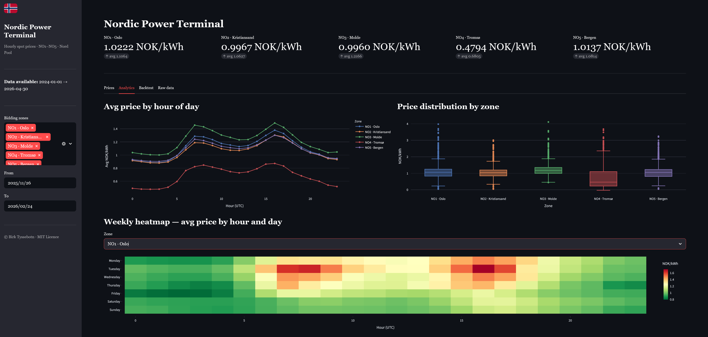
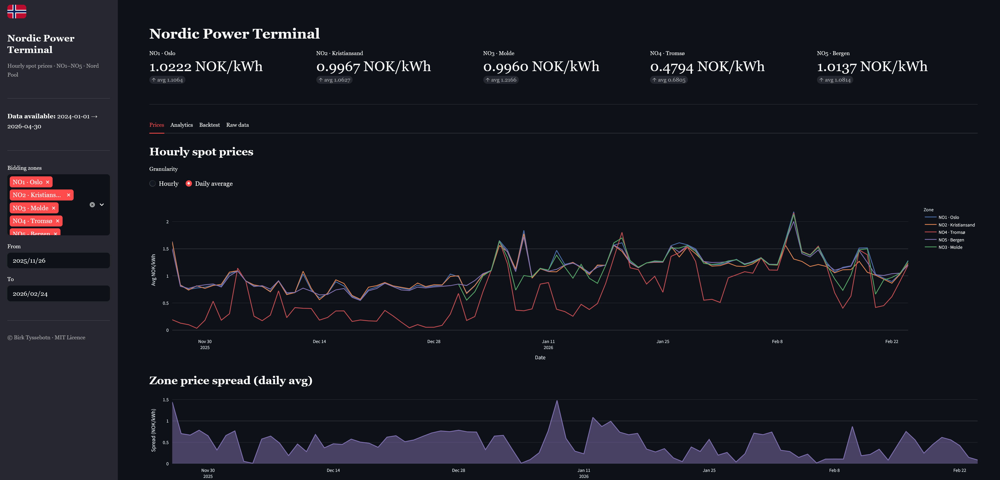
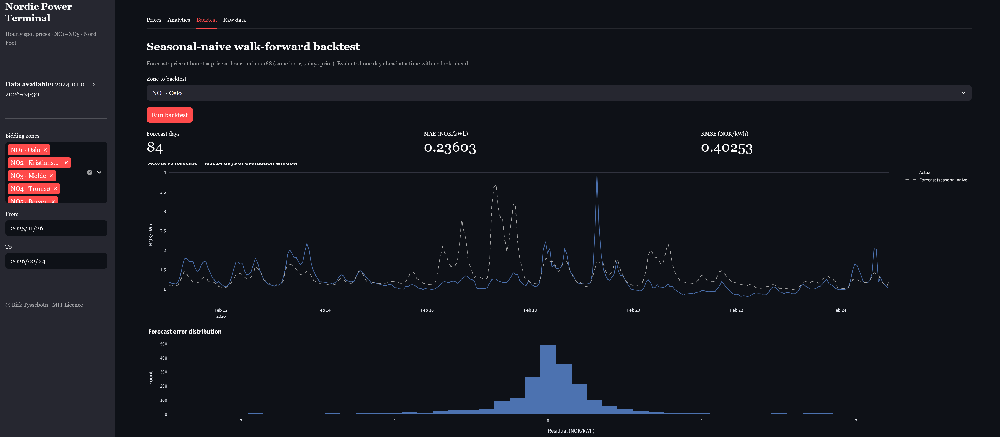

# Nordic Power Terminal

A data engineering and quantitative analysis project for the Nordic electricity market.
The tool ingests hourly spot prices for all five Norwegian bidding zones (NO1–NO5)
from the Nord Pool exchange, stores them in a local DuckDB database, and presents them
through both a command-line interface and an interactive Streamlit dashboard.

Built with Python 3.11, DuckDB, Pandas, Plotly, and Streamlit.

---







---

## Background

The Nordic power market is one of the world's most liquid electricity exchanges.
Norwegian prices vary significantly across five bidding zones due to hydropower reservoir
constraints, inter-regional transmission bottlenecks, and interconnectors with continental
Europe and the UK. This price variation makes it a rich domain for time-series analysis,
forecasting, and quantitative modelling.

---

## Architecture


```
hvakosterstrommen.no API
        │
        ▼
 ┌─────────────┐
 │   Bronze    │  Raw JSON saved to data/bronze/ for audit and replay
 └──────┬──────┘
        │  clean_spot_prices()
        ▼
 ┌─────────────┐
 │   Silver    │  Validated, deduplicated, UTC-normalised DataFrame
 └──────┬──────┘
        │  upsert_spot_prices()
        ▼
 ┌─────────────┐
 │   DuckDB    │  data/npt.duckdb — columnar OLAP store
 └──────┬──────┘
        │
   ┌────┴──────────────────────┐
   ▼                           ▼
CLI (npt)               Streamlit dashboard
query / backtest / export    interactive charts
```

The pipeline follows a [medallion architecture](https://www.databricks.com/glossary/medallion-architecture): bronze (raw) → silver (clean) → gold (analytical output).

---

## Dashboard

Launch the interactive dashboard after ingesting data:

```bash
streamlit run dashboard.py
```

The dashboard provides four tabs:

| Tab | Contents |
|---|---|
| Prices | Hourly or daily price time series, inter-zone spread chart |
| Analytics | Hour-of-day price profile, box plots, weekly heatmap, descriptive statistics |
| Backtest | Walk-forward seasonal-naive evaluation with MAE/RMSE and residual histogram |
| Raw data | Filterable table with one-click CSV download |

---

## Installation

```bash
git clone https://github.com/birktyssebotn/nordic-power-terminal.git
cd nordic-power-terminal
python -m venv .venv
```

**macOS / Linux:**
```bash
source .venv/bin/activate
```

**Windows (PowerShell):**
```powershell
# Allow local scripts if you have not already done so (once per machine)
Set-ExecutionPolicy -ExecutionPolicy RemoteSigned -Scope CurrentUser
.\.venv\Scripts\Activate.ps1
```

Then install:
```bash
pip install -e ".[dev]"
```

Verify:
```bash
npt version
```

---

## Quick start

```bash
# 1. Initialise local data directories
npt init

# 2. Ingest data (adjust date range as needed)
npt ingest-prices --start 2024-01-01 --end 2025-12-31

# 3. Check what is in the database
npt db-summary

# 4. Launch the dashboard
streamlit run dashboard.py
```

---

## CLI reference

| Command | Description |
|---|---|
| `npt version` | Show the installed package version |
| `npt init` | Create local data directories |
| `npt ingest-prices` | Fetch hourly prices and store in DuckDB |
| `npt query-prices` | Display prices from DuckDB in a formatted table |
| `npt backtest` | Run a seasonal-naive walk-forward backtest |
| `npt export` | Export data to CSV or Parquet |
| `npt db-summary` | Print row counts and date ranges per zone |

Run `npt <command> --help` for full option details.

### `npt ingest-prices`

```
--start    TEXT    Start date YYYY-MM-DD  [required]
--end      TEXT    End date inclusive YYYY-MM-DD  [required]
--zones    TEXT    Comma-separated zones (default: NO1,NO2,NO3,NO4,NO5)
--save-bronze      Persist raw JSON to data/bronze/  (default: true)
```

### `npt query-prices`

```
--zones    TEXT    Comma-separated zones (default: NO1)
--start    TEXT    Start date YYYY-MM-DD  [required]
--end      TEXT    End date inclusive YYYY-MM-DD  [required]
--limit    INT     Max rows to display; 0 = all (default: 48)
```

### `npt backtest`

```
--zone     TEXT    Zone to evaluate (default: NO1)
--start    TEXT    Start date YYYY-MM-DD (optional; defaults to all stored data)
--end      TEXT    End date YYYY-MM-DD   (optional)
```

### `npt export`

```
--zones    TEXT    Comma-separated zones (default: all)
--start    TEXT    Start date (optional)
--end      TEXT    End date (optional)
--fmt      TEXT    csv or parquet (default: csv)
--out      TEXT    Output path (default: auto-named under data/gold/)
```

---

## Data model

The `spot_prices` table in `data/npt.duckdb`:

| Column | Type | Description |
|---|---|---|
| `zone` | TEXT | Bidding zone (NO1–NO5) |
| `time_start` | TIMESTAMPTZ | Hour start in UTC |
| `time_end` | TIMESTAMPTZ | Hour end in UTC |
| `nok_per_kwh` | DOUBLE | Price in Norwegian kroner per kWh |
| `eur_per_kwh` | DOUBLE | Price in EUR per kWh |
| `exr` | DOUBLE | NOK/EUR exchange rate used |
| `source` | TEXT | Data source identifier |
| `ingested_at` | TIMESTAMPTZ | Timestamp of database write |

Primary key: `(zone, time_start)` — upserts are idempotent.

---

## Forecasting methodology

`npt backtest` evaluates a **seasonal-naive** model in a walk-forward framework:

- **Forecast**: the price for hour *t* is predicted to equal the price at hour *t − 168* (same hour, 7 days earlier).
- **Walk-forward**: the model steps forward one day at a time, using only data available at that point. No future information leaks into training.
- **Minimum data**: 8 days (168 h lag + 24 h forecast horizon).
- **Metrics reported**: MAE and RMSE in NOK/kWh.

The seasonal-naive model is a standard baseline for hourly power prices, exploiting the strong weekly seasonality of electricity consumption.

---

## Data source

Prices are fetched from the free [hvakosterstrommen.no](https://www.hvakosterstrommen.no) API, which republishes Nord Pool spot prices. The API covers Norway's five bidding zones:

| Zone | Region |
|---|---|
| NO1 | Oslo / Eastern Norway |
| NO2 | Kristiansand / Southern Norway |
| NO3 | Molde / Central Norway |
| NO4 | Tromsø / Northern Norway |
| NO5 | Bergen / Western Norway |

---

## Development

```bash
# Run tests (40 tests across storage, transform, backtesting, and connector)
pytest

# Lint
ruff check src tests

# Format
ruff format src tests
```

### Project layout

```
src/npt/
├── __init__.py
├── settings.py                   # Path config (bronze/silver/gold/duckdb)
├── cli.py                        # Typer CLI entry-points
├── backtest/
│   └── walk_forward.py           # Seasonal-naive walk-forward engine
└── data/
    ├── transform.py               # Silver-layer cleaning and anomaly flagging
    ├── connectors/
    │   └── hvakosterstrommen.py  # HTTP client for spot-price API
    └── storage/
        └── duckdb_store.py       # DuckDB read/write layer

dashboard.py                      # Streamlit dashboard
```

---

## Licence

MIT © Birk Tyssebotn
